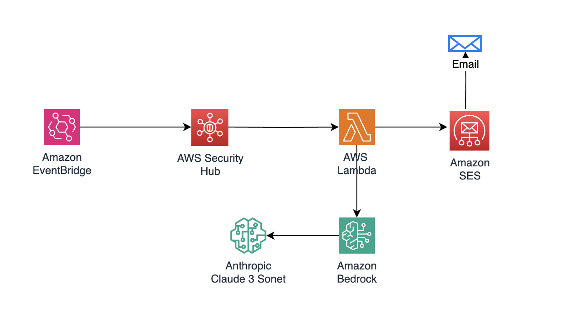

# README.md

## AWS Security Hub Findings Summarizer with AI-Powered Analysis

### Overview

The **AWS Security Hub Findings Summarizer** automates the collection and analysis of AWS Security Hub findings using Amazon Bedrock's Claude 3 Sonnet model. This solution provides daily email reports with AI-generated insights, helping security teams quickly understand their security posture across AWS accounts.

### Key Features

- **Automated Daily Reports**: Runs Monday-Friday at 11 AM IST (5:30 AM UTC). This is configurable.
- **AI-Powered Analysis**: Utilizes Claude 3 Sonnet for intelligent finding summarization.
- **Multi-Account Support**: Aggregates findings across multiple AWS accounts.
- **Severity-Based Classification**: Categorizes findings by CRITICAL, HIGH, and MEDIUM severity levels.
- **Detailed CSV Reports**: Includes comprehensive finding details for further analysis.
- **HTML/Text Email Format**: Provides both HTML and plain text email formats.

### Architecture Details



#### Components

1. **AWS Lambda**
   - **Runtime**: Python 3.12
   - **Memory**: 256MB
   - **Timeout**: 300 seconds
   - **Environment Variables**:
     - `SENDER_EMAIL`
     - `RECIPIENT_EMAIL`
     - `BEDROCK_MODEL_ID`
     - `FINDINGS_HOURS`

2. **Amazon EventBridge**
   - **Schedule**: `cron(30 5 ? * MON-FRI *)`
   - Triggers the Lambda function mon-fri.

3. **Amazon Bedrock**
   - **Model**: Claude 3 Sonnet
   - Used for AI analysis of findings.

4. **Amazon SES**
   - Handles email delivery.
   - Supports attachments and HTML formatting.

5. **AWS Security Hub**
   - Source of security findings.
   - Filtered for FAILED compliance status.

### Prerequisites

#### AWS Services

1. **SecurityHub**
   - Must be enabled in all monitored regions.
   - Security standards enabled as needed.

2. **Amazon SES**
   - Production access required.
   - Verified sender and recipient email addresses.
   - Appropriate sending limits.

3. **Amazon Bedrock**
   - Access to the Claude 3 Sonnet model.
   - Appropriate model invocation limits.

4. **IAM Permissions**
   - SecurityHub read access.
   - SES send email permissions.
   - Bedrock model invocation rights.
   - CloudWatch Logs access.

### Deployment Instructions Using AWS Console

#### Step 1: Prepare Lambda Code

1. **Create a Zip File**:
   Navigate to the directory where your `index.py` file is located and create a zip file:
   ```bash
   zip lambda_function.zip index.py
   ```

#### Step 2: Upload Lambda Code to S3

1. Access the **AWS Management Console**.
2. Navigate to **S3**.
3. Create a new bucket (or use an existing one) where you will store the Lambda function code.
4. Upload the `lambda_function.zip` file to your S3 bucket.

#### Step 3: Prepare CloudFormation Template

1. Download the CloudFormation template file (`aws-securityhub-findings-analyzer.yml`)
2. Ensure that your template includes parameters for `LambdaCodeBucket` and `LambdaCodeKey`.

#### Step 4: Create CloudFormation Stack

1. Navigate back to **CloudFormation** in the AWS Management Console.
2. Click on **Create Stack** and choose **With new resources (standard)**.
3. Under **Specify template**, select **Upload a template file**.
4. Upload the modified `aws-securityhub-findings-analyzer.yml` file.

#### Step 5: Configure Stack Parameters

1. Enter a **Stack name** (e.g., `SecurityHubFindingsAnalyzer`).
2. Provide the necessary parameters:
   - **LambdaCodeBucket**: Your S3 bucket name where the zip file is stored.
   - **LambdaCodeKey**: The key (path) for your uploaded zip file (e.g., `lambda_function.zip`).
   - `SENDER_EMAIL`: Your sender email address for SES.
   - `RECIPIENT_EMAIL`: Your recipient email address for SES.
   - `BEDROCK_MODEL_ID`: The model ID for Amazon Bedrock.
   - `FINDINGS_HOURS`: Specify how many hours back to look for findings (e.g., `24`).

#### Step 6: Review and Create Stack

1. Review the configuration and ensure all parameters are correct.
2. Check the box to acknowledge that AWS CloudFormation might create IAM resources.
3. Click on **Create stack**.

#### Step 7: Monitor Stack Creation

1. Monitor the stack creation process in the CloudFormation console.
2. Wait until the stack status changes to **CREATE_COMPLETE**.

#### Step 8: Set Up EventBridge Rule (Optional)

To automate execution of your Lambda function:

1. Modify your CloudFormation template to include an EventBridge rule that triggers your Lambda function at a specified interval (e.g., daily).
2. Ensure that you include permissions for EventBridge to invoke your Lambda function.

#### Step 9: Execute the Lambda Function

Once deployed, you can manually invoke the Lambda function or let EventBridge trigger it:

1. **Manually Run the Function**:
   Go to the AWS Lambda console, select your deployed function, and click on **Test** to execute it.

### Disclaimer

This solution is provided as-is without any warranties or guarantees of performance or reliability. Users should thoroughly test this solution in their own environments before deploying it in production settings. It is recommended to review AWS best practices regarding security configurations, IAM permissions, and resource management.


